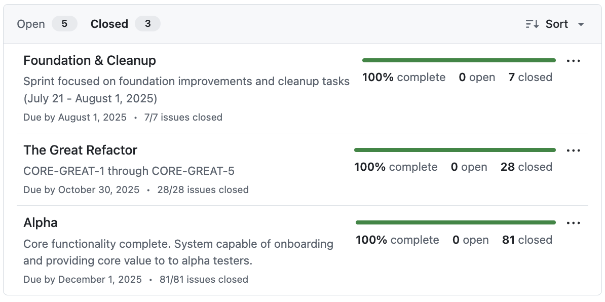
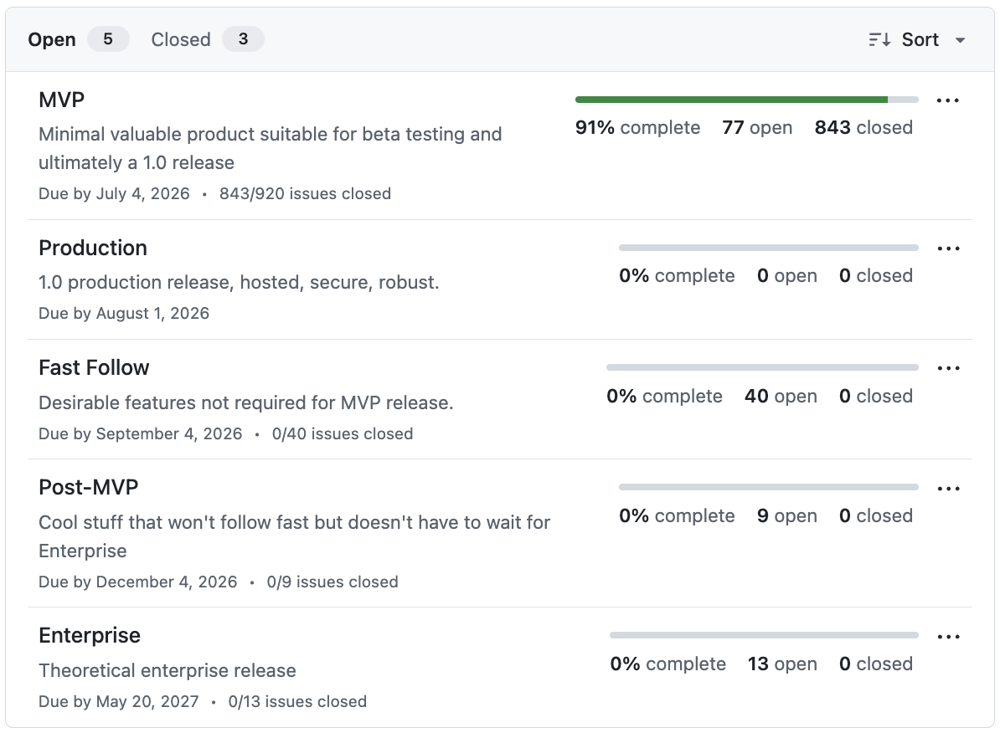

# Sprint Board Structure

_Author: xian (PM) · Last updated: 2026-06-14 · Canonical reference for board / sprint / milestone conventions (linked from docs/NAVIGATION.md). Moved from dev/active to its canonical home by Lead Dev._

The Piper Morgan project gradually adopted githun issue discipline and then a project board, milestones, sprints and so on. The earliest work wasn't fully tracked on github (although almost all was), and the milestones and other details accumulated slowly.

This is a snapshot of how I (xian) organize the project board today

## Structure

New issues are triaged first into a milestone. If it is the current milestone, they also need to be added to a sprint. They get assigned to me and they can have labels but I don't use them really, or do I use priorities in any organized way. I do use Status from the sprint board and issues in upcoming sprints will either be in Product Backlog or occasionally Done when cherrypicked to enable earlier wor.

Issues in the current sprint will start in Sprint Backlog and then should move to In Progress. I do this but until recently agents haven't seen the board so could close issue but not change their status. When complete pending my review and approval they should be moved to "Review for accuracy" and when closed they go to Done. There is also a Blocked status.

## Milestones

There are eight milestones, three closed and five still open:

1. **Foundation & Cleanup** (completed Aug 1, 2025)
2. **The Great Refactor** (completed October 30, 2025)
3. **Alpha** (0.8.0 alpha release, completed December 1, 2025)
4. **MVP** (current milestone, 0.9.0 beta release, due July 4, 2026)
5. **Production** (new milestone, just added, for official 1.0 production release, due August 1, 2026)
6. **Fast Follow** (desirable features not required for MVP or Production, 1.0.1 release due September 4)
7. **Post-MVP** (cool things that won't follow fast but don't have to wait for an Enterprise release, December 4, 2026)
8. **Enterprise** (theoretical future release, uncommitted on roadmap, May 20, 2027)

## Sprints

Past milestones have had sprints, but sprints have gotten more thorough over time and have varied greatly in length. A sprint does not correspond to a single Piper Morgan sprint week, or a single spike of effort, but more like a superepic or entire track of related work.

### Completed sprints

All sprints created after GREAT (the Great Refactor milestone):

1. A1 (Critical Infrastructure)
2. C1 (Craft Pride - CRAFT)
3. A2 (Notion & Errors)
4. A3 (Core Activation)
5. A4 (Standup Epic)
6. A5 (Learning System)
7. A6 (User Onboarding)
8. A7 (Testing & Bufferj)
9. A8 (Alpha Rolloutj
10. T1 (Test Repair)
11. W (Quick Wins)
12. S1 (Security and Critical Fixes)
13. A9 (Alpha Tidy)
14. A10 - Alpha Testing
15. A11 - Alpha Polish
16. T2 (Test Polish)
17. S2 (Security Polish)
18. A12 - Alpha Setup
19. B1 - Beta Enablers
20. A20 - Alpha Testing (round 2)
21. V1 - MUX Vision Formalization
22. X1 - MUX Core Tech
23. V2 - MUX Integration Mapping
24. L1 - MUX List Management
25. I1 - MUX Interaction
26. P1 - MUX Navigation Crisis
27. P2 - MUX Document Management
28. P3 - MUX Cross-channel Unity
29. P4 - MUX A11y and Polish
30. A30 - Alpha round 3 testing - setup
31. A31 - Alpha round 3 testing - workflows
32. M0 - Conversational Glue
33. M1 - MVP Foundation
34. M2 - Conscious Floor + Action Handlers
35. M3 - Artifact Persistence

### Remaining sprints in the current milestone

> ⚠️ **SUPERSEDED 2026-07-04/05 — this list describes the pre-sweep plan. Do not reason from it.**
> The full open backlog was triaged sprint-by-sprint (M3-Quality, M3-Health, M3-Security, **M4**,
> **M5**, RECONNECT). Every open issue was dispositioned as either a **Beta Blocker** or **moved to
> the Production milestone**, to be addressed during beta.
> **Beta Blockers is the final pre-beta sprint**, and the **MVP milestone IS the beta gate** — beta
> ships when every issue on that list closes, not on a calendar date.
> ✅ **Canonical: [`beta-blockers.md`](beta-blockers.md)** · roadmap §M4/§M5 carry the per-sprint
> triage records.
> *(Corrected by PPM 2026-07-30, after this list's staleness caused a real error: it was read as
> live sprint structure and nearly produced a milestone change moving an issue into a swept sprint.)*

1. ~~M4 - Trust + Learning~~ — **✅ TRIAGE CLOSED Jul 5, 2026.** 16 open issues reviewed; 15 moved to Production, remainder dispositioned. See roadmap §M4.
2. ~~RECONNECT - Connector Refactor~~ — buildable scope **DRAINED Jul 1, 2026**; full ADR-070 migration is Production-milestone work.
3. ~~D1 - Beta design quality~~ — **CLOSED Jun 19-20, 2026** (#1297 sign-off, 32/32 done).
4. ~~M5 - Distribution + Polish~~ — **✅ SWEPT Jul 4-5, 2026** in the same triage pass.
5. **Beta Blockers** — ⬅ **the live pre-beta sprint.** Hard gates only, no theme. Canonical list + epics: [`beta-blockers.md`](beta-blockers.md).

### Recurring sprints

1. Q - Recurring Audits
2. SKUNK - Skunkworks projects
3. FLYWHEEL - Process improvement

### Anticipated sprints from Production milestone

1. DIST - Desktop distro
2. D2 - Release design quality

